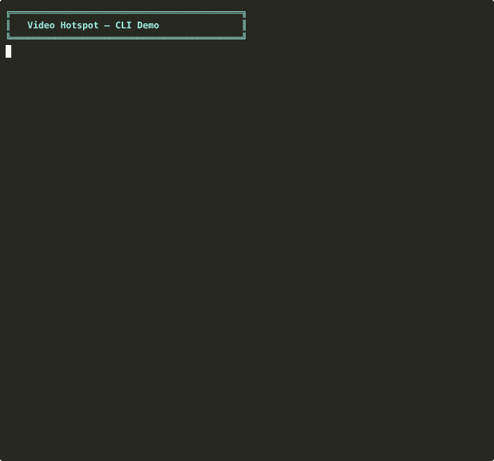
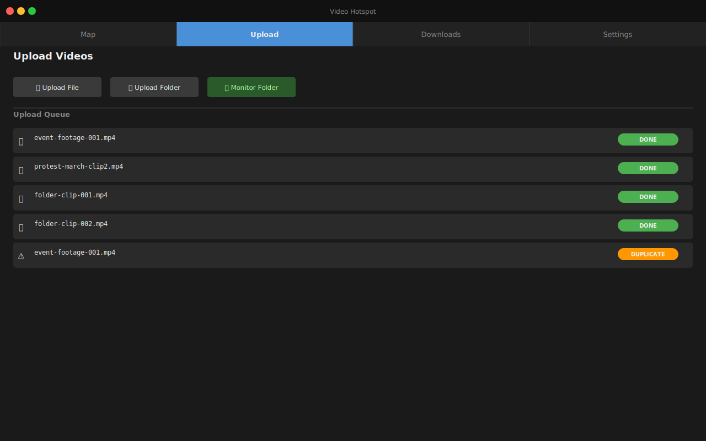
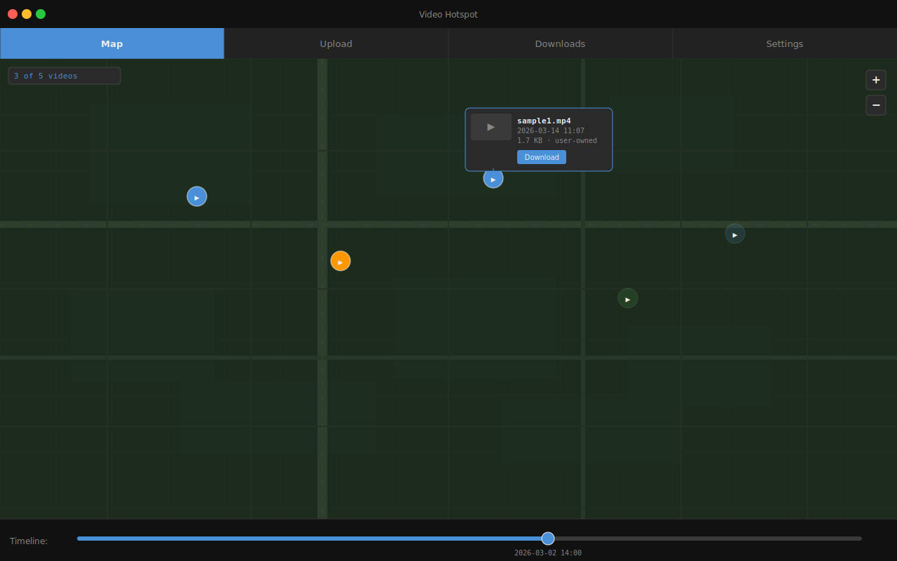

# Video Hotspot — FURPS Specification

> **Privacy-preserving video upload and geolocation-based event mapping on the Logos stack**

## CLI Demo



---

## Loading in Logos Basecamp

Video Hotspot ships as a Qt plugin (`libvideo_hotspot_plugin.so`) implementing the
`IComponent` interface (`com.logos.component.IComponent`) from
[jimmy-claw/scala](https://github.com/jimmy-claw/scala). Basecamp discovers plugins by
scanning a well-known directory on startup.

### 1 — Build the plugin

```bash
cmake -B build -DBUILD_UI_PLUGIN=ON
cmake --build build --target video_hotspot_plugin
# Output: build/ui/plugin/libvideo_hotspot_plugin.so  (Linux)
#         build/ui/plugin/libvideo_hotspot_plugin.dylib  (macOS)
```

### 2 — Install into the Basecamp plugin directory

```bash
PLUGIN_DIR="$HOME/.local/share/Logos/LogosAppNix/plugins/video_hotspot"
mkdir -p "$PLUGIN_DIR"
cp build/ui/plugin/libvideo_hotspot_plugin.so "$PLUGIN_DIR/"
cp ui/plugin/video_hotspot_plugin.json "$PLUGIN_DIR/"
```

The JSON manifest (`video_hotspot_plugin.json`) is read by Basecamp to identify the
plugin type, version, and category before `dlopen`-ing the `.so`.

### 3 — Launch Basecamp

No extra flags are needed — Basecamp scans the plugins directory on every launch:

```bash
logos-app
```

> ⚠️ **TBD:** The exact `logos-app` binary name and install location are not yet
> confirmed for production Basecamp builds. The path above matches the Nix packaging
> convention observed in `jimmy-claw/scala`. Adjust if your Basecamp binary differs.

If you need to point Basecamp at a non-default plugin directory (e.g. during
development), try:

```bash
LOGOS_PLUGIN_PATH="$HOME/.local/share/Logos/LogosAppNix/plugins" logos-app
```

> ⚠️ **TBD:** `LOGOS_PLUGIN_PATH` is inferred from Basecamp conventions; the exact
> environment variable name has not been confirmed upstream. Check `logos-app --help`
> or the jimmy-claw/scala README once a live Basecamp build is available.

### 4 — Verify it loaded

Qt logs plugin resolution to stderr. Look for:

```
QFactoryLoader: loading plugin "com.logos.component.IComponent" from …/video_hotspot/libvideo_hotspot_plugin.so
```

One-liner to check at runtime:

```bash
logos-app 2>&1 | grep -i "video.hotspot\|IComponent"
```

If the line appears, the plugin was found and instantiated. If nothing appears, confirm
the `.so` path and that `video_hotspot_plugin.json` is present alongside it.

### Mock mode (no live Logos node)

When Basecamp calls `createWidget(nullptr)` (no `LogosAPI` context), Video Hotspot
falls back to local SQLite storage and filesystem-only uploads — useful for UI
development without a running Logos node. See `VideoHotspotPlugin.cpp` for the
`logosAPI == nullptr` branch.

> ⚠️ **TBD:** Full `LogosAPI` wiring (passing real `logos::storage::Client` and
> `logos::messaging::Client` into `StorageClient` / `MessagingClient`) is pending the
> logos-cpp-sdk integration. ADR-0002 and ADR-0003 describe the intended flow.

---

## GUI Demo (Upload tab · Map tab)

| Upload Screen | Map Screen |
|:---:|:---:|
|  |  |

> **Note:** The Qt GUI requires `Qt6Quick` and a display. The screenshots above are
> generated mockups of `VideoHotspotApp.qml`. To run the real app:
> ```
> cmake -DBUILD_UI_APP=ON ..
> make video-hotspot-app
> ./video-hotspot-app
> ```

---

## Quick Start

### Prerequisites

- Qt 6 (Core, Concurrent, Network, Sql)
- CMake ≥ 3.22, C++17 compiler

### Build

```bash
git clone <repo>
cd logos-video-hotspot
cmake -B build
cmake --build build
```

The CLI binary lands at `build/cli/video-hotspot`.

### CLI Usage

All commands support `--human` (`-H`) for human-readable output, or emit JSON by default.

#### Check node status

```bash
./build/cli/video-hotspot status --human
# Logos connection: connected (mock)
# Videos indexed:   0
# Pending messages: 0
# User-owned bytes: 0
# Cached bytes:     0
# Total used:       0
```

#### Upload a single video

```bash
./build/cli/video-hotspot upload path/to/video.mp4 --human
# Uploaded: path/to/video.mp4
# CID:      44da7506d4de4d647af7ebffad3893e8ff7c0cefee50c573fc1660b17f2bc78a
```

#### Deduplication — upload the same file again

```bash
./build/cli/video-hotspot upload path/to/video.mp4 --human
# Duplicate: path/to/video.mp4
# CID:       44da7506d4de4d647af7ebffad3893e8ff7c0cefee50c573fc1660b17f2bc78a (already uploaded)
```

#### Upload all videos in a folder

```bash
./build/cli/video-hotspot upload-folder path/to/folder --human
# Uploaded: path/to/folder/clip-a.mp4
# CID:      dc325b95ab25d5e15f41fc5253860bf8986a068875438c1cfca1f5ccc231ec36
# Uploaded: path/to/folder/clip-b.mp4
# CID:      8ec7e4b5670438b9e2044735dad688319ccd71480e1eae81710b12a94835614e
# Queued 2 file(s)...
#
# Summary: 2 uploaded, 0 failed
```

#### List indexed videos

```bash
./build/cli/video-hotspot list --human
# Total: 3 video(s)
#   CID:  44da7506d4de4d647af7ebffad3893e8ff7c0cefee50c573fc1660b17f2bc78a
#   Geo:  0, 0
#   Time: 2026-03-14T11:07:00Z
#   Size: 1730 bytes
#   Type: video/mp4
#   Owned: yes
#   ...
```

#### Download a video by CID

```bash
./build/cli/video-hotspot download 44da7506d4de4d647af7ebffad3893e8ff7c0cefee50c573fc1660b17f2bc78a ./downloads --human
# cid: 44da7506d4de4d647af7ebffad3893e8ff7c0cefee50c573fc1660b17f2bc78a
# local_path: ./downloads/44da7506d4de4d647af7ebffad3893e8ff7c0cefee50c573fc1660b17f2bc78a
# status: ok
```

#### Clear cached (non-user-owned) videos

```bash
./build/cli/video-hotspot cache clear --human
# cleared_bytes: 0
# cleared_count: 0
# status: ok
```

#### JSON output (default, no flag needed)

```bash
./build/cli/video-hotspot status
# {"cached_bytes":0,"connected":true,"index_count":0,"mode":"mock","pending_messages":0,"status":"ok","total_used_bytes":0,"user_owned_bytes":0}
```

#### Monitor a folder for new videos (foreground process)

```bash
./build/cli/video-hotspot monitor path/to/folder
```

---

## Overview

Video Hotspot is a Qt miniapp running inside the Logos app ("Basecamp") for uploading, storing, and collectively mapping events through video footage. Users import video files that are tagged with timestamp and geolocation. The system indexes these clips by location and time, allowing anyone to browse a live map of documented events.

### Inspiration

This spec synthesizes concepts from [LoreLine.Live](https://github.com/logos-co/ideas/issues/7) (collaborative documentary creation, raw footage preservation, collective memory) with geolocation-based event discovery. Like LoreLine, Video Hotspot believes:

- **Raw footage, your own opinion** — No overlays, no editorial framing. Present what was captured.
- **Everyone is a documentarian** — Ordinary people capture extraordinary moments; those fragments deserve to become part of something bigger.
- **Individuals can compete with institutions** — Collectively, distributed cameras have more angles than any news crew.

### Core Differentiator

Video Hotspot adds **spatial intelligence** to collective documentation: indexing videos by geolocation and timestamp so users can browse a map and scrub through time to see what happened, where, when.

---

## FURPS+ Specification

### F — Functionality

#### Video Upload
- [ ] Import individual video files via file picker (manual select)
- [ ] Import all videos from a folder (folder picker)
- [ ] Folder monitoring: watch a folder, auto-upload new files added to it
- [ ] Deduplication: compute content hash before upload — never upload the same file twice
- [ ] Upload queue with progress indicators and retry logic
- [ ] Background uploading (continues while browsing map)

#### Timestamp & Geolocation Tagging
- [ ] Extract timestamp from video file metadata (EXIF/creation date)
- [ ] If video has EXIF geolocation: use it automatically
- [ ] If no EXIF geolocation: prompt user to pinpoint location on interactive map
- [ ] Store precise coordinates + timestamp — no fuzzy zones or clustering for now

#### Map Browsing
- [ ] Interactive map showing video pins at their geolocations
- [ ] Timeline slider with granularity modes: **hour, day, week, month, year** — user selects the granularity; slider scrubs through the selected time unit
- [ ] Click pin to preview/play video
- [ ] Zoom and pan across regions
- [ ] Basic search by location (center map on searched area)

#### Video Playback & Download
- [ ] Play videos directly from Logos Storage
- [ ] Download videos for offline viewing
- [ ] Downloaded videos become seedable (user becomes uploader for that content)
- [ ] Track which videos are user-owned vs. cached downloads

#### Logos Stack Integration
- [ ] **Logos Messaging** — Live/real-time indexing as videos are uploaded
  - Publishes metadata (CID, geolocation, timestamp) on upload
  - Subscribers receive new video announcements in real-time
- [ ] **Logos Storage** — Decentralized storage for video files (content-addressed)
- [ ] **Logos Blockchain** — Batch/historical indexing
  - Periodic batches (e.g., 24-hour aggregates) of video metadata committed to blockchain
  - Indexing only — not for proofing or authentication

#### CLI (Headless Mode)
Command-line interface for scripting, automation, and end-to-end testing. Runs against Logos Core in headless mode (no Qt UI required).

**Commands:**
- [ ] `upload <file>` — Upload a single video file
- [ ] `upload-folder <path>` — Upload all videos in a folder
- [ ] `monitor <path>` — Start monitoring a folder for new videos (foreground process)
- [ ] `list` — List all indexed videos (timestamp, geolocation, CID)
- [ ] `download <id>` — Download a video by ID/CID
- [ ] `status` — Show node status, storage usage, connection state
- [ ] `cache clear` — Clear cached (non-user-owned) videos

**Output:**
- [ ] JSON output by default (machine-readable, deterministic)
- [ ] `--human` flag for human-readable formatted output
- [ ] Exit codes follow standard conventions (0 = success, non-zero = error)

---

### U — Usability

#### Screens (Detailed)

##### 1. Upload Screen
The upload screen is the primary entry point for adding content:

- **File Picker Button** — Opens system file dialog to select one or more video files
- **Folder Picker Button** — Select a folder; all video files within are queued for upload
- **Folder Monitor Toggle** — Enable/disable watching a configured folder for new files
  - When enabled: any new video dropped into the monitored folder auto-queues
  - Visual indicator shows monitoring status (active/inactive)
- **Upload Queue** — List of pending/in-progress uploads showing:
  - Filename and thumbnail preview
  - Progress bar (percentage complete)
  - Status: pending, uploading, processing, complete, failed
  - Retry button for failed uploads
- **Dedup Status** — Indicator when a file is skipped (already uploaded, hash match)
  - "Already uploaded" badge with link to existing entry
- **Geolocation Prompt** — For files without EXIF location:
  - Inline map widget to pinpoint location
  - Required before upload proceeds

##### 2. Map Screen
The map screen is the core browsing experience:

- **Interactive Map** — Full-screen map (OpenStreetMap or similar)
  - Video pins displayed as markers at their geolocations
  - Pin density visualization: areas with many videos show clustered indicators
  - Pins color-coded or sized by recency (brighter/larger = more recent)
- **Timeline Slider** — Horizontal slider at bottom of screen
  - Granularity selector: **hour, day, week, month, year**
  - User selects granularity; slider scrubs through the selected time unit
  - Shows date/time labels at slider position
  - As slider moves, pins appear/disappear based on timestamp
  - "Play" button to animate through time automatically
- **Pin Interaction**
  - Hover: show timestamp and thumbnail preview
  - Click: expand to video player overlay
  - Download button on expanded view
- **Zoom Controls** — Standard +/- or scroll-to-zoom
- **Search Bar** — Type location name to center map on that area

##### 3. Settings Screen
Configuration and preferences:

- **Storage Allocation**
  - Slider or input to set maximum local storage for cached/downloaded videos
  - Current usage display (e.g., "Using 2.3 GB of 10 GB allocated")
- **Folder Monitor Path**
  - Display currently monitored folder path
  - Button to change monitored folder
  - Toggle to enable/disable monitoring
- **Network Settings**
  - Bandwidth limits (optional)
  - Connection status indicator

##### 4. Downloaded / Cache Management Screen
Manage local video storage:

- **Space Usage Bar** — Visual bar showing total allocated vs. used space
  - Breakdown: user-owned vs. cached (downloaded from others)
- **Video List** — Two sections:
  - **Your Videos** (user-uploaded) — Never auto-deleted
    - Each entry shows: thumbnail, title/filename, size, upload date
    - Manual delete option (removes from local + stops seeding)
  - **Cached Videos** (downloaded from others) — Deletable
    - Each entry shows: thumbnail, title/filename, size, download date
    - Checkbox selection for batch delete
    - "Clear All Cached" button
- **Auto-Clean Settings**
  - When storage limit reached: auto-delete oldest cached videos (not user-owned)
  - Display estimated days of cache remaining at current usage rate
- **Manual Delete Controls**
  - Select multiple cached videos
  - Delete selected button
  - Confirmation dialog

#### Interface Guidelines
- [ ] Clean, minimal interface — map-centric design
- [ ] Dark mode default (field use, nighttime events)
- [ ] Integrates within Basecamp app navigation

---

### R — Reliability

#### Offline Operation
- [ ] Upload queue persists across app restarts
- [ ] Downloaded videos playable offline
- [ ] Local database for pending uploads (SQLite or equivalent)
- [ ] Sync on reconnect: background service handles upload queue

#### Upload Resilience
- [ ] Chunked upload with resumption (no full-file restart on failure)
- [ ] Automatic retry with exponential backoff
- [ ] Corruption detection (checksum verification pre-upload)
- [ ] Dedup check prevents wasted bandwidth on re-uploads

#### Data Integrity
- [ ] Content-addressed storage (CID-based) ensures immutability
- [ ] Hash verification on download

#### Graceful Degradation
- [ ] If Logos Storage unreachable: local-only mode with periodic retry
- [ ] If Logos Messaging unreachable: metadata batched and sent when available
- [ ] Clear status indicators: user knows when offline/syncing/synced

---

### P — Performance

#### Upload Time
- [ ] Target: <10s upload start-to-confirmation for 30s clip on broadband
- [ ] Chunk size tuned for typical bandwidth (512KB–2MB chunks)
- [ ] Parallel chunk upload where beneficial
- [ ] Dedup check (hash comparison) completes before upload starts

#### Map Rendering
- [ ] Target: <2s initial load of map with 100 pins visible
- [ ] Lazy loading: fetch video details on demand (click pin)
- [ ] Tile caching for offline map access in previously viewed areas
- [ ] Smooth timeline scrubbing (no UI freeze)

#### Resource Usage
- [ ] Video compression before upload (H.265/HEVC where supported)
- [ ] Background process: minimal CPU/memory footprint when idle
- [ ] Configurable storage limits to prevent disk bloat

---

### S — Supportability

#### Platform
- [ ] **Qt miniapp** running inside Basecamp (Logos desktop app)
- [ ] Cross-platform via Qt: Windows, macOS, Linux

#### Storage Management
- [ ] User-configurable local storage limits
- [ ] Auto-clean: oldest cached videos deleted when limit reached
- [ ] User-owned videos never auto-deleted
- [ ] Manual deletion controls for both owned and cached content

#### Open Formats
- [ ] Video: MP4 (H.264/H.265), WebM (VP9) supported
- [ ] Metadata: JSON, schema-documented
- [ ] Export: download original files

#### Observability
- [ ] Upload history visible to user
- [ ] Storage used / allocated display
- [ ] Sync status indicators
- [ ] Folder monitor status

#### CLI & Headless Mode
- [ ] CLI and Qt UI share the same core module APIs (no duplicate logic)
- [ ] Logos Core runs in headless mode when CLI is invoked (no window spawned)
- [ ] CLI commands are scriptable and deterministic (designed for e2e testing)
- [ ] CLI exit codes and JSON output enable automated test harnesses

---

### + — Hardware & Deployment

#### Basecamp Integration
- [ ] Runs as Qt miniapp inside Basecamp (Logos desktop app)
- [ ] Inherits Basecamp's platform support (Windows 10+, macOS 11+, Linux)
- [ ] Uses Basecamp's Logos stack connections (Messaging, Storage, Blockchain)

#### Logos Stack Dependencies
- [ ] **Logos Messaging** — Real-time indexing
  - Publish video metadata on upload
  - Subscribe to new video announcements
- [ ] **Logos Storage** — Decentralized video storage
  - Upload/download via client library
  - Content-addressed (CID-based)
- [ ] **Logos Blockchain** — Batch indexing
  - 24-hour batches of video metadata
  - Indexing only (not proofing/authentication)

#### Security & Privacy
- [ ] Metadata minimization: only timestamp + explicit user-provided geolocation
- [ ] No PII storage
- [ ] Downloaded videos contribute to network (seeding)

---

## MVP Scope

For initial release:

1. **Upload** — File picker, folder picker, folder monitor, dedup, upload queue
2. **Geolocation** — EXIF extraction or manual pin placement
3. **Map View** — Browse pins by location, timeline slider with granularity modes for time filtering
4. **Download & Cache** — Download videos, storage management, auto-clean
5. **Offline Queue** — Capture offline, sync when connected

---

## References

- [LoreLine.Live (logos-co/ideas #7)](https://github.com/logos-co/ideas/issues/7) — Collaborative documentary platform concept
- [Logos Network](https://logos.co)

---

## Status

**Draft** — Awaiting review

*Created: 2026-03-14*
